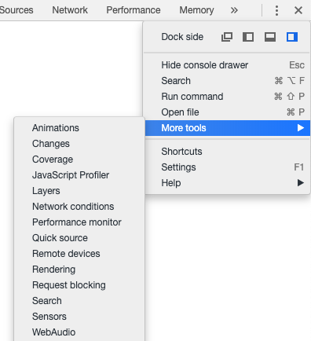

## Inspect me:

Open the [given link](http://2018shell.picoctf.com:53213/). The flag is splitted into three parts, each hidden in the HTML file, CSS file and JS file. You can find these by opening the inspector (F12 on Chrome), and look at the source tab.

***

## Client side is still bad:

Check out the source for the [given link](http://2018shell.picoctf.com:8930/). You can see that the page ask you to guess the flag, so take a look at the form. However, the form `onSubmit` event is defined to be a `verify` function, which is defined in a script tag:

```js
function verify() {
    checkpass = document.getElementById("pass").value;
    split = 4;
    if (checkpass.substring(split * 7, split * 8) == "}") {
        if (checkpass.substring(split * 6, split * 7) == "ebbd") {
            if (checkpass.substring(split * 5, split * 6) == "d_d0") {
                if (checkpass.substring(split * 4, split * 5) == "s_ba") {
                    if (checkpass.substring(split * 3, split * 4) == "nt_i") {
                        if (
                            checkpass.substring(split * 2, split * 3) == "clie"
                        ) {
                            if (
                                checkpass.substring(split, split * 2) == "CTF{"
                            ) {
                                if (checkpass.substring(0, split) == "pico") {
                                    alert("You got the flag!");
                                }
                            }
                        }
                    }
                }
            }
        }
    } else {
        alert("Incorrect password");
    }
}
```
As you can see, the flag is splitted in chunk, and is compared against the plaintext. You can easily find out the flag right now.

***

## Logon 
The [website](http://2018shell.picoctf.com:62746) allows you to login as anything you want, but you have to login as admin to get the flag. However, if you checkout the cookie, you will see a field called `Admin` with the value `False`. Change it to `True` and get the flag

***

## Irish name repo
Go to the [given link](http://2018shell.picoctf.com:59464). As there is nothing much to do with the main page, we will checkout the [login page](http://2018shell.picoctf.com:59464/login.html) in the sidebar.

Entering anything into the form will not work, however, if you look at the form source code, you can see a hidden field named `debug`. Set it to false and then submit the form.

The page will show you a SQL query which is used to find the corresponding user. If you are familiar with SQL, you will know that this query is susceptible to SQL injection, the easy type. In order to authenticate, input `' OR '1'='1` into both field.

***

## Mr. Robots
The problem name is a hint. Checkout the page's [robots.txt file](http://2018shell.picoctf.com:15298/robots.txt) to find out a hidden route. This route contains the flag.

***

## No Login
Same as the [Logon problem](#logon) above.

***

## Secret Agent
The [page](http://2018shell.picoctf.com:46162) require you to be a Googlebot to get the flag. You can change the user agent string to pretend to be a Googlebot. In Chrome, you can open the network conditions menu in the inspector options, and change the agent string to Googlebot:



After that, refresh to get the flag

***

## Artisinal Handcrafted HTTP
The problem require you to send some HTTP request to an endpoint. However, every time you open a connection, the endpoint makes you solve a captcha before receiving any other data, therefore, you can't make such request on your browser. The only way to solve this is to send the raw HTTP request by hand.

First make a `GET` request to root:
```
nc 2018shell.picoctf.com 4914
Real Business Corp., Internal Proxy
Version 2.0.7
To proceed, please solve the following captcha:

 _____           _____
|____ |    _    / __  \  ______
    / /  _| |_  `' / /' |______|
    \ \ |_   _|   / /    ______
.___/ /   |_|   ./ /___ |______|
\____/          \_____/


> 5
Validation succeeded.  Commence HTTP.

GET / HTTP/1.1
Host: flag.local
```

Here's the response

```html
HTTP/1.1 200 OK
x-powered-by: Express
content-type: text/html; charset=utf-8
content-length: 321
etag: W/"141-LuTf9ny9p1l454tuA3Un+gDFLWo"
date: Mon, 23 Sep 2019 08:44:03 GMT
connection: close
<html>
    <head>
        <link rel="stylesheet" type="text/css" href="main.css" />
    </head>
    <body>
        <header>
            <h1>Real Business Internal Flag Server</h1>
            <a href="/login">Login</a>
        </header>
        <main>
            <p>You need to log in before you can see today's flag.</p>
        </main>
    </body>
</html>
```

You can see that the login page resides at `/login`. Make another request to the page:

```
GET /login HTTP/1.1
Host: flag.local
```

And the response is:

```html
HTTP/1.1 200 OK
x-powered-by: Express
content-type: text/html; charset=utf-8
content-length: 498
etag: W/"1f2-UE5AGAqbLVQn1qrfKFRIqanxl9I"
date: Mon, 23 Sep 2019 09:22:36 GMT
connection: close
<html>
    <head>
        <link rel="stylesheet" type="text/css" href="main.css" />
    </head>
    <body>
        <header>
            <h1>Real Business Internal Flag Server</h1>
            <a href="/login">Login</a>
        </header>
        <main>
            <h2>Log In</h2>

            <form method="POST" action="login">
                <input type="text" name="user" placeholder="Username" />
                <input type="password" name="pass" placeholder="Password" />
                <input type="submit" />
            </form>
        </main>
    </body>
</html>
```

Now, you have to make a `POST` request to `/login` to login in to the website. Send:

```
POST /login HTTP/1.1
Host: flag.local
Content-Type: application/x-www-form-urlencoded
Content-Length: 38

user=realbusinessuser&pass=potoooooooo
```

Remember to include the `Content-Length` header. I can't seem to make the whole thing work without it. Also, mind the blank line between the headers and the body.

The response is:

```
HTTP/1.1 302 Found
x-powered-by: Express
set-cookie: real_business_token=some token here...; Path=/
location: /
vary: Accept
content-type: text/plain; charset=utf-8
content-length: 23
date: Mon, 23 Sep 2019 09:28:12 GMT
connection: close

Found. Redirecting to /
```

The important bit is the cookie. You must include it in every subsequent requests in order for the server to recognize you as authenticated. Make another `GET` request at root like the following:

```
GET / HTTP/1.1
Host: flag.local
Cookie: real_business_token=your token from above...
```

And the flag shall show up before your eyes.

---