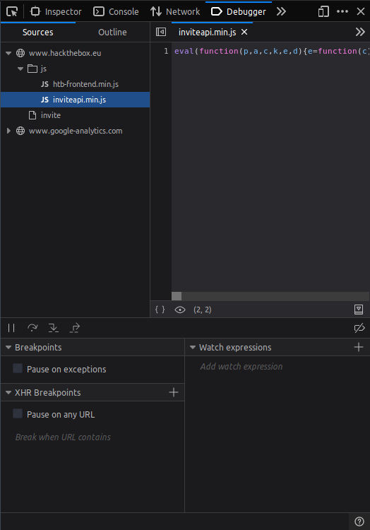
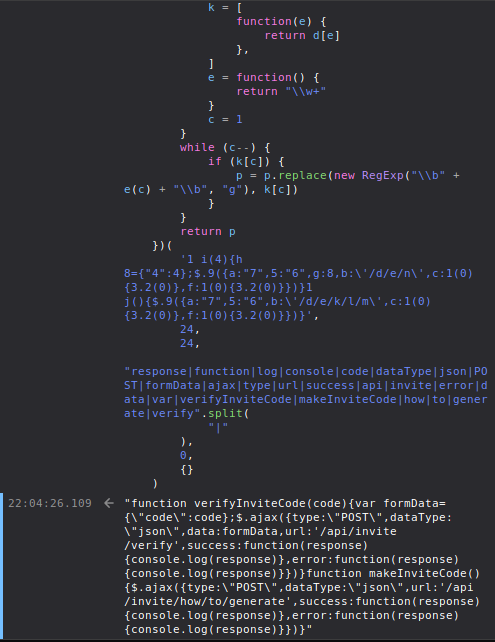

## Preface

So my friend just show me this page:

[](https://www.hackthebox.eu/)

This page is so interesting that to even sign up for the page is a hacking challenge that you have to solve.

Let's start right away.

## Invitation

Let's go to the invitation page by clicking the Join button somewhere down the home page.


Looking at the page source, you can see a suspicious js file named `inviteapi.min.js`



Here's the file content:

```js
eval(
    (function(p, a, c, k, e, d) {
        e = function(c) {
            return c.toString(36)
        }
        if (!"".replace(/^/, String)) {
            while (c--) {
                d[c.toString(a)] = k[c] || c.toString(a)
            }
            k = [
                function(e) {
                    return d[e]
                },
            ]
            e = function() {
                return "\\w+"
            }
            c = 1
        }
        while (c--) {
            if (k[c]) {
                p = p.replace(new RegExp("\\b" + e(c) + "\\b", "g"), k[c])
            }
        }
        return p
    })(
        '1 i(4){h 8={"4":4};$.9({a:"7",5:"6",g:8,b:\'/d/e/n\',c:1(0){3.2(0)},f:1(0){3.2(0)}})}1 j(){$.9({a:"7",5:"6",b:\'/d/e/k/l/m\',c:1(0){3.2(0)},f:1(0){3.2(0)}})}',
        24,
        24,
        "response|function|log|console|code|dataType|json|POST|formData|ajax|type|url|success|api|invite|error|data|var|verifyInviteCode|makeInviteCode|how|to|generate|verify".split(
            "|"
        ),
        0,
        {}
    )
)
```

The `js~eval` function will execute whatever the inner function's output is. Let's copy it out and run it inside the console.



The output is escaped and minified. After un-escaping it prettifying the code will look like this:

```js
function verifyInviteCode(code) {
    var formData = { code: code }
    $.ajax({
        type: "POST",
        dataType: "json",
        data: formData,
        url: "/api/invite/verify",
        success: function(response) {
            console.log(response)
        },
        error: function(response) {
            console.log(response)
        },
    })
}
function makeInviteCode() {
    $.ajax({
        type: "POST",
        dataType: "json",
        url: "/api/invite/how/to/generate",
        success: function(response) {
            console.log(response)
        },
        error: function(response) {
            console.log(response)
        },
    })
}
```

Take a look at the `makeInviteCode` function. The function make a request to the server and will tell you how to get the invitation code. Let's run it 


The data is encoded with base64. Decrypting it will yield:
```
In order to generate the invite code, make a POST request to /api/invite/generate
```

Use the `js~$.ajax` function like the one above to make the request


Once again the data looks like it is encoded with base64 (if you see a bunch of alphanumeric characters and a few "=", it is almost certainly base64). 

Decrypting the message will give you the key:
```
TKKFO-AEVZU-NINHD-LKDMF-KRUPP
``` 

Don't bother trying to use my key. They generate a unique key for every user, so my key will be invalid on your machine. 

Input the key, and they will lead you to the sign up page. Complete the form to create your own account.